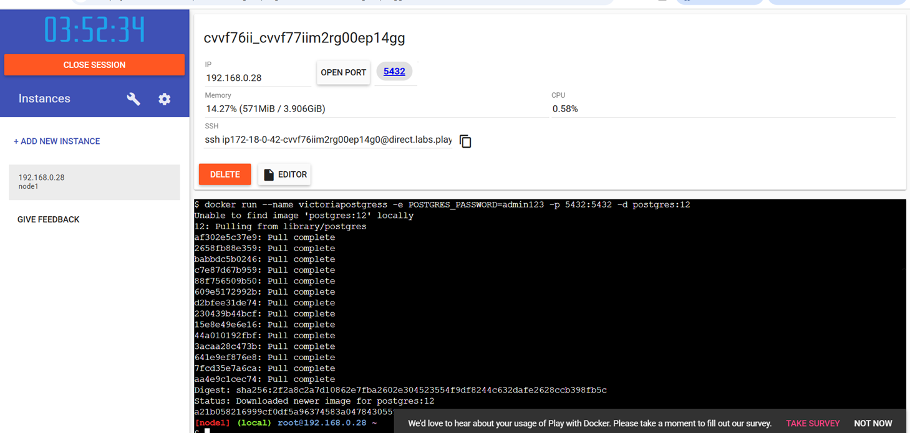

# Practica servidor web
## 1. Titulo
Volumenes de datos
## 2. Tiempo de duración
8 horas 
## 3. Fundamentos:
     Contenedor: 

     Base de datos:

     Volumen de datos: Los volúmenes son un mecanismo de almacenamiento que permite persistir datos más allá del ciclo de vida de un contenedor individual.

     Datos persistentes: Cuando un contenedor se inicia, utiliza los archivos y la configuración proporcionados por la imagen. Cada contenedor puede crear, modificar y eliminar archivos, y lo hace sin afectar a otros contenedores. Cuando el contenedor se elimina, también se eliminan estos cambios en los archivos.

## 4. Conocimientos previos.
   
Para realizar esta practica el estudiante necesita tener claro los siguientes temas:
- Comandos linux.
- Plataforma de Docker playground entorno en el que se va a trabajar 
- Terminal o consola para lineas de comandos

## 5. Objetivos a alcanzar
   
- Entender el concepto de contenedores.

- Entender el concepto de base de datos.
- Entender el concepto de volumenes de datos.
- Entender la diferencia entre Base de datos y volumenes de datos.
- Guardar los volumenes de datos sin que el contenedorsiga existiendo o no.
## 6. Equipo necesario:
  
- Computador con sistema operativo Windows/Linux
- Plataforma Docker playground

## 7. Material de apoyo.
   
- Documentacion de tendencias tecnologicas.
- Docker playground
- Video ilustrativo
- Documentacion sobre comandos basicos para la creacion de volumenes de datos.
  
## 8. Procedimiento

Paso 1:Crear nueva instancia  

Paso 2: Verificar la version

paso 3: intalar la imagen de postgres

paso 4: intallar la imagen hola mundo, para probar (nombre, contenido, ruta)

paso 5: intallar el contenedor usando docker container run hello world

paso 6: Verificacion del contendor creado

paso 7: Verificacion de los 2 contenedores creados

paso 8: Intalla la imagen nginx

paso 9: modificar el index.html 

paso 10: Copiar informacion de index 1 a index 2

paso 11: Copiar informacion de index 2 a index 1

paso 12: verificacion de la informacion

paso 13: revision de los puertos 

## 9. Resultados esperados:
    
Al finalizar esta practica se pudo evidenciar la importancia de la practica anterior sobre el uso de comandos basicos, enterder como usar un contenedor y servidor.

## 10. Bibliografía
    
Xu, Q., Awasthi, M., Malladi, K. T., Bhimani, J., Yang, J., & Annavaram, M. (2017, April). Docker characterization on high performance SSDs. In 2017 IEEE International Symposium on Performance Analysis of Systems and Software (ISPASS) (pp. 133-134). IEEE.

Naik, N. (2017, October). Docker container-based big data processing system in multiple clouds for everyone. In 2017 IEEE International Systems Engineering Symposium (ISSE) (pp. 1-7). IEEE.

audio:

<audio controls>
  <source src="media/nota.ogg" type="audio/ogg">
 
</audio>
